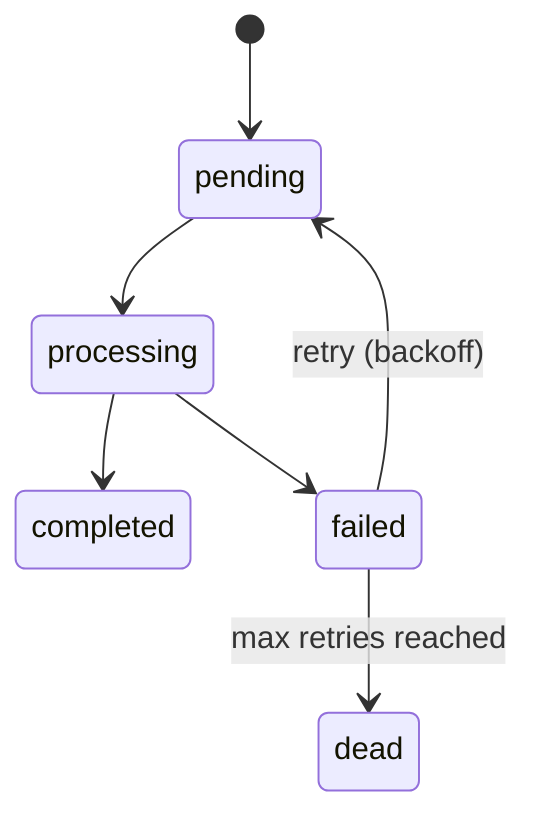
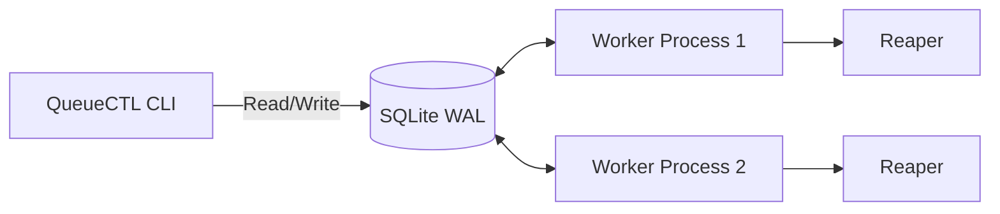

# QueueCTL
Developed By Suryansh Khare(GitHub: https://github.com/Ayushkhar)
# Deployed Link
https://queuectl.suryanshkhare.online/
# Live video demonstration
https://www.loom.com/share/922691c04da94450aded753bd0e673ec

## Architecture Diagrams

**Job Lifecycle State Diagram**


**Component Diagram**


## Table of Contents
- [QueueCTL](#queuectl)
  - [Architecture Diagrams](#architecture-diagrams)
  - [Table of Contents](#table-of-contents)
  - [Setup Instructions](#setup-instructions)
  - [Usage Examples](#usage-examples)
  - [Architecture Overview](#architecture-overview)
  - [Assumptions & Trade-offs](#assumptions--trade-offs)
  - [Testing Instructions](#testing-instructions)
  - [Demo Video](#demo-video)
  - [Bonus Features Implemented](#bonus-features-implemented)
  - [Known Limitations / Future Improvements](#known-limitations--future-improvements)

## Setup Instructions

### Native Development Setup

1. **Clone and Install**
   ```bash
   git clone https://github.com/YOUR_USERNAME/queuectl.git
   cd queuectl
   npm install
   ```

2. **Build**
   ```bash
   npm run build
   ```

3. **Verify Installation**
   ```bash
   node dist/index.js --help
   ```
   *Optional:* You can use `npm link` to use the `queuectl` command globally.

### Docker (Recommended for Demo & Verification)

Docker is the source of truth for demo and verification purposes.

```bash
docker compose up -d
docker compose run queuectl --help
```

## Usage Examples

**Enqueue Jobs**
```bash
queuectl enqueue '{"command":"echo hello"}'
queuectl enqueue '{"command":"curl https://api.example.com"}' --priority 10 --timeout 60
queuectl enqueue --file jobs.json
```

**Worker Management**
```bash
queuectl worker start --count 3
queuectl worker stop
queuectl worker stop --timeout 60
queuectl worker stop --force
```

**Status & Listing**
```bash
queuectl status
queuectl status --json
queuectl list --state pending
queuectl list --state completed --limit 5 --json
queuectl logs job-42
```

**Dead Letter Queue (DLQ)**
```bash
queuectl dlq list
queuectl dlq retry job-17
queuectl dlq retry --all
```

**Configuration Management**
```bash
queuectl config set max-retries 5
queuectl config get backoff-base
queuectl config list
```

**Dashboard**
```bash
queuectl dashboard --port 3000
```

## Architecture Overview

### Persistence
The system uses SQLite in **WAL (Write-Ahead Logging)** mode. WAL mode enables concurrent reads and writes across multiple processes without database corruption or SQLITE_BUSY errors immediately failing operations (using a busy timeout).

### Atomic Claim Query
Job claiming uses a single atomic SQL statement instead of a read-then-write approach.
```sql
UPDATE jobs SET state = 'processing' ... WHERE id = (SELECT id FROM jobs WHERE state IN ('pending', 'failed') ... LIMIT 1)
```
If `.changes === 1`, the worker successfully claimed the job. If `0`, no job was available. This guarantees no duplicate executions.

### Exponential Backoff
Jobs retry using the formula: `delay = base ^ attempts seconds`.
- Attempt 1: 2^1 = 2s
- Attempt 2: 2^2 = 4s
- Attempt 3: 2^3 = 8s

### Graceful Shutdown
Sending a `SIGTERM` (via `queuectl worker stop`) flags the worker to stop processing new jobs. It will finish its current job and exit cleanly. A `--timeout` parameter forces a kill (`SIGKILL`) if jobs hang.

### Stale-lock Reaper
If a worker crashes mid-job (e.g., OOM kill, server restart), the job remains stuck in `processing`. The reaper periodically scans for `processing` jobs where `locked_at` is older than `stale-timeout-s` and reclaims them using the standard retry/failure logic.

## Assumptions & Trade-offs

- **max_retries semantics:** `max_retries` represents the **maximum total attempts allowed**, not "retries after the first try". Thus, `max_retries = 3` means exactly 3 executions before hitting the DLQ.
- **WAL Mode:** Chosen for single-file, concurrent process safety. A trade-off is the existence of auxiliary `-wal` and `-shm` files.
- **Polling vs Push:** Workers poll the database. It eliminates the need for complex message brokers like Redis, but introduces a tiny latency (up to `poll-interval-ms`).
- **Force-kill Timeout:** If a graceful stop times out, workers are forcefully killed (`SIGKILL`). The in-flight job will be stuck until the reaper reclaims it.
- **DB Location:** Defaults to `./queuectl.db` in the CWD, overridable by `QUEUECTL_DB_PATH`. Running commands from different directories without the env var will create separate databases.
- **Environment:** Docker is the recommended, definitive environment for demo and evaluation, though native Windows is supported for local development.

## Testing Instructions

1. **Unit & Integration Tests**
   ```bash
   npm test
   ```
   Runs the `vitest` suite covering core logic and all 5 required integration scenarios.

2. **Black-box CLI Smoke Tests**
   ```bash
   # On POSIX (Linux/macOS/Git Bash)
   ./scripts/verify.sh

   # On Windows (PowerShell)
   .\scripts\verify.ps1
   ```

## Demo Video

[Demo Video](PASTE_YOUR_DRIVE_LINK_HERE)

## Bonus Features Implemented

- **Job output logging:** Captures stdout/stderr (view with `queuectl logs <id>`).
- **Job timeout handling:** Kills long-running commands.
- **Scheduled/delayed jobs:** Start jobs at a future ISO timestamp (`--run-at`).
- **Metrics/execution stats:** Included in `queuectl status`.
- **Priority queues:** Jobs with higher priority are executed first.
- **Minimal web dashboard:** Live, auto-refreshing UI (`queuectl dashboard`).

## Known Limitations / Future Improvements

- No horizontal scaling across multiple servers (bound to local SQLite file).
- No job dependencies or DAG workflows.
- Dashboard lacks authentication.
- No automatic log rotation for worker stdout.
