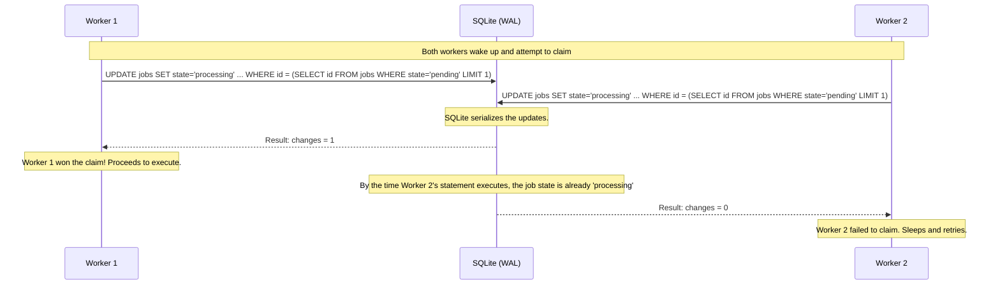

# QueueCTL Design Document

This document provides a deeper technical dive into the architecture and decisions behind QueueCTL.

## Schema ER Diagram

```mermaid
erDiagram
    JOBS {
        string id PK
        string command
        string state "pending, processing, completed, failed, dead"
        int attempts
        int max_retries
        int priority
        string run_at "ISO timestamp or null"
        string next_attempt_at "ISO timestamp or null"
        int timeout_seconds
        string worker_id "Null if not processing"
        string locked_at "ISO timestamp when claimed"
        string last_error
        string stdout
        string stderr
        int exit_code
        string created_at
        string updated_at
    }
    
    WORKERS {
        string worker_id PK
        int pid
        string status "idle, busy, stopping, stopped"
        string current_job_id "Null if idle"
        string started_at
        string last_heartbeat
    }
    
    CONFIG {
        string key PK
        string value
    }

    JOBS ||--o| WORKERS : "processed by"
```



## Atomic Job Claiming (Concurrency Protection)

A common pitfall in database-backed queues is the "read-then-write" race condition, where two workers `SELECT` the same pending job and both `UPDATE` it to processing, causing duplicate execution.

QueueCTL solves this using a single atomic SQL statement leveraging SQLite's transactional guarantees:



## Crash Recovery Flow

If a worker is hard-killed (e.g., `kill -9` or server power loss) while executing a job, the job is left stuck in the `processing` state because the worker never ran its shutdown hooks.

The Stale-lock Reaper solves this:

```mermaid
flowchart TD
    A[Worker hard-crashed mid-job] --> B[Job stuck in 'processing' state]
    B --> C[Another worker runs reaper task]
    C --> D{Is locked_at > stale_timeout_s?}
    D -- No --> E[Ignore, worker still processing]
    D -- Yes --> F[Reclaim Job]
    F --> G[Increment attempts]
    G --> H{attempts >= max_retries?}
    H -- Yes --> I[Move to DLQ (state='dead')]
    H -- No --> J[Move to 'failed', set next_attempt_at]
    J --> K[Job picked up again after backoff]
```

## Why SQLite + WAL?

The assignment restricts the use of pre-built queue systems like Redis. SQLite is ideal for a self-contained CLI tool, but standard SQLite locks the entire database during writes, heavily restricting concurrency.

**Write-Ahead Logging (WAL)** mode flips this paradigm:
- Writers append to a separate `-wal` file instead of directly modifying the main database file.
- Readers can read concurrently while a writer is writing.
- Using `busy_timeout = 5000`, if multiple workers try to write simultaneously, they politely wait up to 5 seconds instead of immediately throwing `SQLITE_BUSY` errors.
- This provides Redis-like concurrency safety without requiring a separate server process.
